# Students-Performance
This project explores different attribute that influences a student performance in mathematics, reading and writing test.\
The project uses student performance dataset obtained from kaggle.

# Dataset Description

*This dataset has 1000 samples with 8 attributes/features, here is the list of features in this dataset:

1.**Gender**: This column categorise the students as either male or female.\
2.**Race/Ethnicity**: This column classify the students into 5 different ethnicity, i.e group A, group B, group c, e.t.c.\
3.**Parental level of education**: This column gives detail on the highest level of education of the parents.\
4.**Lunch**: This attributes the type of meal the student ate e.g Standard or free/reduced meal.\
5.**Test preparation course**: This column classify the level of preparation of the student for the test, e.g None, Completed.\
6.**Math Score**: This is the score obtained by each student in the mathematics test.\
7.**Reading Score**: This is the score obtained by each student in the reading test.\
8.**Writing Score**: This is the score obtained by each student in the writing test.

# This project seeks to visually answer the following question as regards students performance in a test:
*Number of student by gender and student performance in the test by gender.\
*The ethnic group with the highest number of student participation.\
*Highest level of education attained by most parent.\
*Relationship between lunch/student meal and student performance.\
*Test preparation course and student test performance.\
*Influence of race/ethnicity, parental level of education on students performance.

# Number of student by gender and student performance in the test by gender.
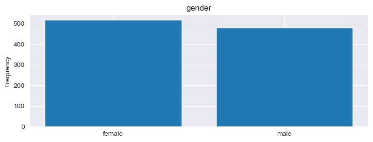

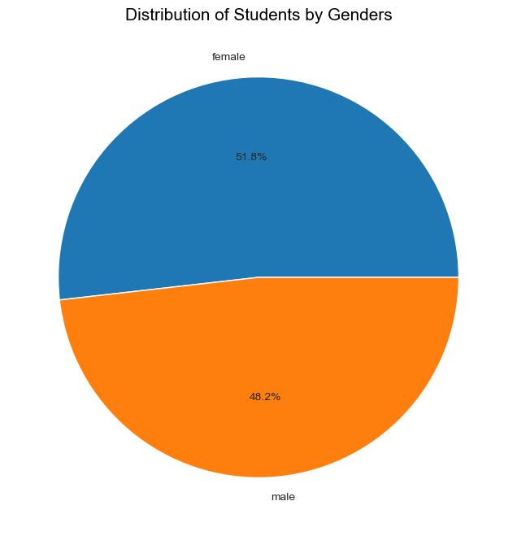

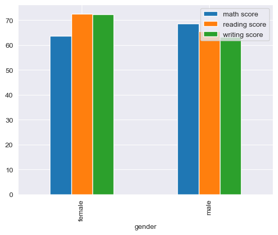

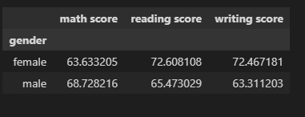

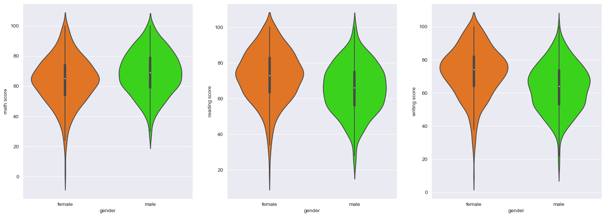

# The ethnic group with the highest number of student participation.
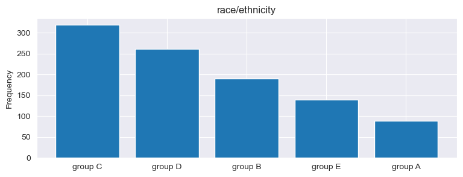

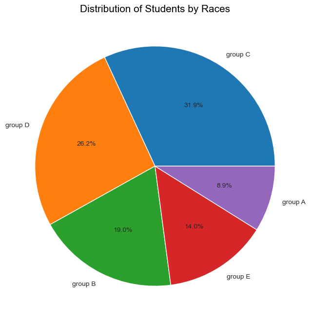

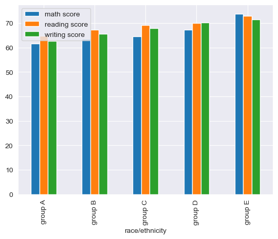

# Highest level of education attained by most parent.

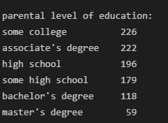

# Relationship between lunch/student meal and student performance.
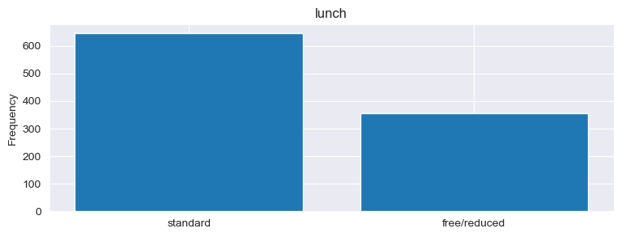

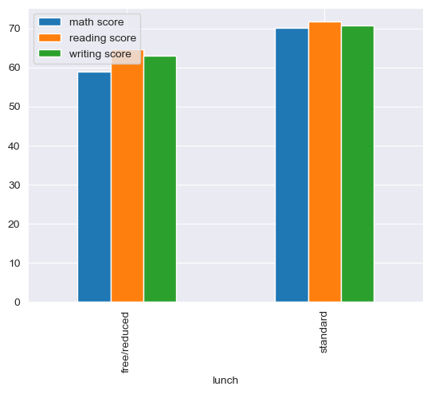

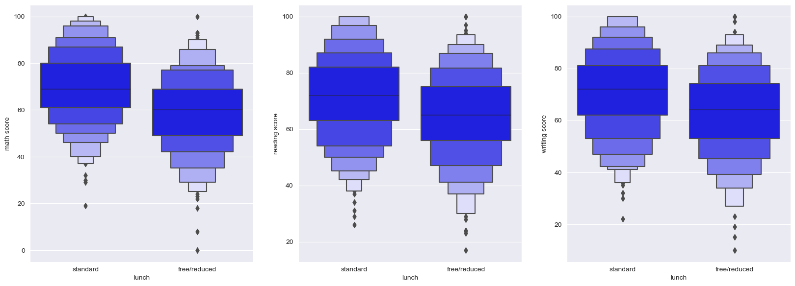

# Test preparation course and student test performance
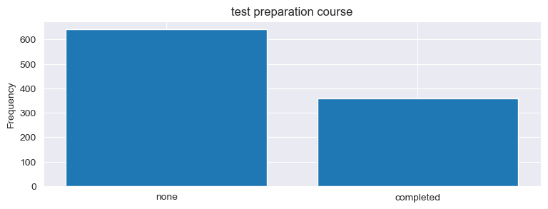

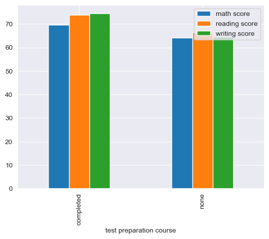

# Influence of race/ethnicity, parental level of education on students performance

